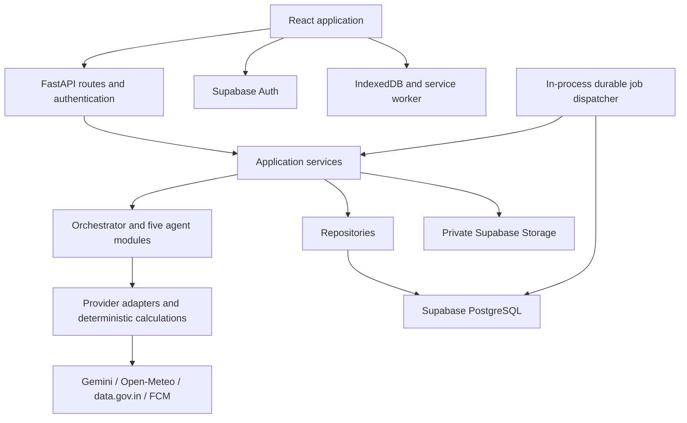
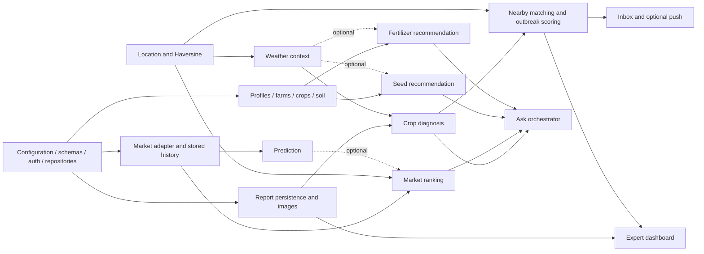

# AgriVision AI — Implementation Architecture

This document translates `FINAL_BUILD.md` into implementation decisions for future Codex tasks. The master specification defines product scope and phase order; this document resolves its schema, endpoint, and runtime ambiguities. Build one phase at a time. This is an architecture specification; the folders and contracts below are planned artifacts.

## 1. Final system architecture

Use a React single page application, one FastAPI modular monolith, and one Supabase project. All five agents are ordinary Python modules in the same backend. No microservices, agent framework, message broker, Redis, vector database, or separate inference service is required.

| Layer | Decision |
|---|---|
| Frontend | React 18, Vite 5, TailwindCSS 3, React Router; JavaScript/JSX consistent with the master plan |
| UI integrations | Leaflet/OSM, Recharts, Lucide icons, browser geolocation and Web Speech API |
| Client state | AuthContext, LanguageContext, component state, shared fetch wrapper and resource hooks |
| Backend | Python 3.11, FastAPI, Uvicorn, Pydantic validation/settings, shared asynchronous HTTP client |
| Persistence | Supabase PostgreSQL, Auth, and private Storage |
| AI | Gemini through one adapter; model selected by `GEMINI_MODEL`, never hardcoded in agents |
| External data | Open-Meteo weather/geocoding; AGMARKNET/data.gov.in market prices |
| Predictions | Local scikit-learn/XGBoost model artifacts loaded into the FastAPI process |
| Notifications | Database inbox first; optional Firebase Cloud Messaging delivery |
| Offline | Service worker for app assets; IndexedDB for selected cached responses and report drafts |
| Deployment | Static frontend host + one persistent backend instance + managed Supabase |

The master plan names Gemini 2.0 Flash and particular SDK snippets. Treat these as its original integration baseline: confirm available model/SDK versions during the integration phase and select a supported model through configuration. Do not change business contracts when changing providers or SDKs.



### Frontend responsibilities

Provide the nine screens in the master plan: Home, Report Problem, Crop Result, My Crops, Nearby Alerts, My Reports, Market Intelligence, Seed & Fertilizer, and Admin Dashboard. Add small auth/profile screens, farm/soil forms, and the notification inbox required by those flows.

Routes: `/`, `/login`, `/signup`, `/profile`, `/report`, `/reports`, `/reports/:id`, `/crops`, `/alerts`, `/market`, `/farm`, `/admin`. `CropResult` is the detail screen at `/reports/:id`. Admin routing improves navigation; backend authorization enforces access.

Components render typed-by-contract domain responses, collect and validate inputs, and show loading, empty, partial, stale, error, and retry states. Keep calculations affecting risk, price ranking, or nutrient guidance in the backend. Browser Haversine is only for display.

Use a shared fetch wrapper for bearer tokens, errors, cancellation, request IDs, and bounded GET retries. Resource hooks refresh after mutations; notifications poll every 30 seconds while the app is visible and online. Start without Redux, GraphQL, WebSockets, or Supabase Realtime.

English and Telugu UI strings live in `i18n/en.json` and `i18n/te.json`. Send `language: en|te` with advisory requests; translate prose, never JSON keys or canonical crop/disease codes. Voice produces editable text and requires farmer submission. Do not store raw audio.

### Backend boundaries

| Module | Responsibility |
|---|---|
| Routes and schemas | HTTP parsing, authentication dependencies, input/output validation, status codes |
| Application services | Ownership checks, workflow sequencing, persistence, transactions, idempotency |
| Agents | Domain reasoning over supplied context; structured results without HTTP or database writes |
| Adapters | Provider authentication, requests, normalization, timeouts, provider error translation |
| Repositories | Explicit database queries; no prompts, HTTP calls, or business decisions |
| Jobs | Retryable diagnosis, outbreak evaluation, push delivery, scheduled data refresh |
| Utilities | Pure unit conversion, geography, formatting, and calculation helpers |

Use one long-lived HTTP client initialized by FastAPI lifespan. Avoid blocking the event loop with synchronous SDK calls or model work; use async interfaces or a bounded thread pool. Routes call services directly for short work and return a persisted resource/job for long work.

## 2. Authentication, authorization, and image storage

The browser uses Supabase Auth directly for signup, login, session refresh, and logout. Do not build duplicate `/api/auth/signup` or `/api/auth/login` proxies from the illustrative master plan. Let its SDK manage the session; do not add a second token store.

Every protected FastAPI request carries `Authorization: Bearer <access_token>`. Validate the JWT with the project's supported verification mechanism, including signature, expiry, issuer, and audience. Use the verified subject as farmer identity; no endpoint accepts a client-selected `farmer_id` for ownership.

Create a farmer profile keyed to `auth.users.id` with an idempotent database trigger. Use only server-managed `app_metadata.role` for `farmer|expert|admin`; never trust editable user metadata. Experts may inspect/review reports and manage alerts; admins have those permissions plus operational controls. Clients cannot assign roles.

Enable RLS on all application tables. Normal repositories use the user's JWT so ownership policies apply. A separate privileged repository context serves jobs, cross-farmer aggregation, and authorized expert/admin operations. The service-role key bypasses RLS, so it must never be the default request client and must never enter the frontend.

Use a **private** `crop-images` bucket, resolving the public URL examples in the master plan. Store object paths, not signed URLs. The backend streams validated uploads and issues short-lived read URLs only after ownership or expert authorization. Storage policies deny anonymous and cross-owner access.

Accept one JPEG, PNG, or WebP per report, maximum 5 MiB. Validate actual decoded format and image dimensions, strip metadata including EXIF location, and keep full-resolution sanitized content in Storage. Create a maximum 1024 px derivative for Gemini. Reject malformed or excessive-pixel images before model use. Never fetch an arbitrary user-supplied image URL.

## 3. Agent architecture

Agents have an explicit `AgentContext`: authenticated actor, language, validated question, selected farm/crop/report, location and provenance, optional soil test, source data with timestamps, and request deadline. Fetch only context relevant to that task.

Each agent returns an `AgentResult`: `status` (`complete|partial|needs_input|unavailable`), `agent`, `schema_version`, validated domain `result`, `sources`, `warnings`, optional `missing_fields`, and model/rule version. Application services persist results. Agents cannot grant access, choose SQL, send notifications, or recursively call one another.

| Agent | Inputs and work | Output and dependencies |
|---|---|---|
| Crop Intelligence | Image/text, canonical crop, location, season, optional fresh weather; Gemini structured diagnosis | Possible problem, symptoms, actions, confidence, severity, expert flag; Gemini + weather context |
| Market Intelligence | Commodity/variety, quantity, location, prices, cost assumptions, optional local prediction | Ranked estimated net returns and full cost breakdown; market service + prediction + geography; arithmetic needs no LLM |
| Seed Recommendation | Target crop, season, irrigation, soil, region, curated variety references | 2–4 suitable varieties where supported, suitability reasons, sowing/spacing information; curated catalog + optional Gemini explanation |
| Fertilizer | Soil test with units/basis, crop, growth stage, region, versioned agronomic references | Nutrient assessment and supported application plan; deterministic rules + optional Gemini explanation |
| Outbreak Alert | Persisted successful diagnoses, disease/crop codes, location, nearby independent reports, fresh weather | Risk score, level, evidence IDs, recipient candidates; deterministic scoring + geographic matching |

### Orchestration

Explicit feature screens call their domain endpoints without intent classification. `/api/ask` is the conversational entry point. Prefer an explicit valid intent from the UI, otherwise classify English/Telugu with a small Gemini classification prompt. Validate against `crop_problem|market_query|seed_query|fertilizer_query|weather_query|general`.

On classifier failure, apply a small bilingual keyword fallback and ask the user to choose a feature if ambiguous. Missing required context returns `needs_input` with concrete fields; never invent soil values, coordinates, quantities, or crop identity. Route exactly once. Weather routes to weather service; general returns localized help. No conversation memory infrastructure is needed; requests include their selected context.

`/api/ask` cannot secretly create a farmer report from an exploratory question. For `crop_problem`, it returns a report-form draft/action; the farmer submits through the standard report workflow. With an owned `report_id`, it may return that report's existing analysis. Seed/fertilizer/market intents reuse the same application services as their dedicated endpoints and expose persisted recommendation IDs.

### Diagnosis and agronomic guardrails

Validate Gemini output against Pydantic schemas; one repair attempt is allowed within the total deadline. Treat user text and model output as untrusted data. No tool execution from generated content.

Confidence is an uncalibrated model estimate, not a verified probability. Default `needs_expert=true` below 0.70 confidence, for critical severity, or when evidence is ambiguous. Preserve uncertain diagnoses as possible problems. Only recognized canonical disease codes participate in matching; uncertain/unmapped names do not silently form clusters.

Maintain a small versioned crop/variety/agronomy reference catalog with source, region, units, and review date. Seed claims without grounding are flagged as unverified. Soil test nutrient values are not directly equivalent to crop fertilizer requirements: do not turn the master plan's illustrative threshold/subtraction logic into authoritative doses. Specific quantities require a compatible reviewed rule; otherwise return qualitative guidance and `needs_expert`.

Always include the master plan's fertilizer message: “Consult your local agricultural extension officer for precise dosing.” Preserve nutrient basis (`N`, `P` versus `P2O5`, `K` versus `K2O`) and convert explicitly. Gemini may explain an approved quantity but cannot override it.

## 4. Main workflows and durable background work

### Report to diagnosis to alert

1. Browser saves a draft with a stable UUID `client_request_id`, including its optional image blob.
2. `POST /api/reports` creates or returns the farmer's report. `POST /api/reports/{id}/image` uploads its optional image. Drafts are not outbreak evidence.
3. `POST /api/reports/{id}/analyze` atomically changes analysis state to `queued` and inserts a unique diagnosis job. Return `202` with report ID and status URL.
4. The dispatcher loads owned report context, gets optional weather, runs the crop agent, and validates the result.
5. Persist the diagnosis and enqueue outbreak evaluation in one database transaction. On provider failure, retain the report and mark analysis `failed`; a deliberate retry can queue it again.
6. Outbreak service computes risk, updates/creates a matching alert, creates inbox notifications, and queues push delivery transactionally.
7. Frontend polls report detail every two seconds only while queued/running and visible. Stop on a terminal state or offline; offer refresh after a bounded polling period.

### Job execution

Use a small `jobs` table and a single dispatcher started in FastAPI lifespan. Deploy one Uvicorn worker initially. This avoids losing important work on a restart without adding a queue service.

Claim jobs atomically using a database transaction and row locking; record a lease, attempt count, and `run_after`. Recover expired leases after restart. Each handler uses a stable deduplication key and transactional writes; do not promise exactly-once external delivery. A short wake interval, bounded concurrency, and capped retries are sufficient. Database transactions spanning several writes use narrowly scoped SQL functions/RPCs with restricted execution, rather than assuming separate Supabase requests are atomic.

Job types: `diagnose_report`, `evaluate_outbreak`, `deliver_push`, `refresh_market_prices`, `expire_alerts`. No generic workflow engine. Periodically enqueue daily market refresh and alert expiry with date-based unique keys; on startup catch up missed work. Weekly/on-demand ML training is an explicit backend command, outside request handling, using the same repository and feature definitions.

### Outbreak rules

Use bounding-box SQL followed by Haversine distance. Compute longitude bounds from latitude; the fixed ±0.09° example is not a universal 10 km box. Default radius is 10 km and report lookback is 14 days. `/api/nearby/reports` can use a separate 30-day browsing window.

Count distinct farmers with matching commodity/disease, successful analysis, sufficient confidence or expert verification, and review status `pending|verified`. Exclude `needs_review` and `resolved` reports. Count at most one recent report per farmer in a cluster. Require at least three distinct farmers, including the source farmer, for warning/critical outbreak publication; lower-evidence high scores become an advisory for expert attention.

Use the master plan formula: severity weights 0.25/0.50/0.75/1.00; base = confidence × severity weight; weather multiplier starts at 1, adds 0.20 for humidity >80% and 0.15 for observed rain in the previous 48 hours; community factor = min(other matching farmers × 0.15, 0.50); clamp base × multiplier + community factor to [0,1]. Missing/stale weather contributes no bonus and is recorded as missing. Forecast rain does not count as observed rain. The unused `spread_rate` argument is omitted until a sourced rule exists.

Intervals are explicit: `<0.30` monitor without publishing; `[0.30,0.60)` advisory; `[0.60,0.80)` warning; `>=0.80` critical, subject to the evidence gate. Risk level is distinct from diagnosis severity. These are versioned heuristic rules, not a validated epidemiological probability model.

Within a transaction serialized by commodity/disease, reuse the nearest active matching alert within radius; otherwise create one. Keep its center stable, link evidence through `alert_reports`, and increment revision only for a meaningful level/status change. Initial expiry is 72 hours from last qualifying evidence; refresh on new evidence. Queries exclude expired alerts even if the expiry job is delayed.

Warnings notify nearby farmers with an active matching crop; critical alerts notify all opted-in farmers within radius. Advisory alerts appear in-app without push. Use farm location first, otherwise profile location; deduplicate recipients. A report review/status change queues reevaluation, so removed evidence cannot leave an unsupported warning active.

Nearby farmer responses expose aggregate counts, disease/crop, coarse alert center, and approximate distance. Never expose another farmer's name, exact farm pin, contact data, report text, or image. The authorized expert dashboard has a separate detailed contract.

## 5. Database schema

All primary keys are UUID unless stated otherwise. Timestamps are `timestamptz` in UTC; business dates use `date`. Mutable entities include `created_at` and `updated_at`. Money uses `numeric(14,2)`, measurements use constrained numeric values, and coordinates use double precision with latitude/longitude range checks. Nullable means unknown, never zero by default.

### Core tables

| Table | Columns and relationships |
|---|---|
| `farmers` | `id` PK/FK → auth.users; full_name, optional phone/email display fields, language `en\|te`, nullable latitude/longitude, district, state, location_source `gps\|manual`, location_updated_at, alerts_opt_in default false. Auth remains authoritative for identity/contact verification. |
| `farms` | id, farmer_id FK → farmers, farm_name, area_acres, irrigation_type `rainfed\|drip\|sprinkler\|flood`, optional location/address/district/state. Area >0 and <=1000. |
| `commodities` | id, unique code, name_en, name_te, provider_aliases JSONB. Seeded shared catalog of crop identities, including tomato/rice/chili/cotton. |
| `crops` | id, farm_id FK → farms, commodity_id FK → commodities, variety, season `kharif\|rabi\|zaid`, sowing_date, expected_harvest, growth_stage, status `active\|harvested\|failed`. A row is a farmer's crop cycle. |
| `reports` | id, farmer_id FK, optional crop_id FK, optional commodity_id FK, client_request_id UUID, description, voice_transcript, language, optional image_path, image_state `none\|uploaded`, nullable location/district/state snapshot, analysis_state `draft\|queued\|running\|succeeded\|failed`, review_status `pending\|verified\|needs_review\|resolved`, ai_diagnosis JSONB, diagnosis_schema_version, disease_code, confidence, severity, model_used, prompt_version, weather_context JSONB, analysis_error_code, analyzed_at. |
| `soil_tests` | id, farm_id FK, ph, nitrogen_kg_ha, phosphorus_kg_ha, potassium_kg_ha, phosphorus_basis `P\|P2O5\|unknown`, potassium_basis `K\|K2O\|unknown`, organic_carbon_pct, soil_type `clay\|loam\|sandy\|silt\|red\|black`, previous_commodity_id FK nullable, test_date, optional lab/method. Store successive tests as history. |
| `mandis` | id, unique provider_key, market_name, district, state, nullable latitude/longitude, coordinate_source. Provider names alone are not globally unique. |
| `market_prices` | id, mandi_id FK, commodity_id FK, variety_code default `unspecified`, grade default `unspecified`, min_price, max_price, modal_price, currency `INR`, unit `quintal`, price_date, source, source_record_id nullable, fetched_at, original_unit. Normalize before insertion. |
| `recommendations` | id, farmer_id FK, farm_id/crop_id/soil_test_id optional FKs, client_request_id, type `seed\|fertilizer\|market\|general`, input_context JSONB snapshot, recommendation JSONB, schema_version, sources JSONB, warnings JSONB, model_used nullable, rule_version nullable. Append completed results. |
| `alerts` | id, source_report_id FK nullable, commodity_id FK nullable, disease_code nullable, alert_type `disease_outbreak\|pest_warning\|weather_risk`, severity, risk_score, level `advisory\|warning\|critical`, center_lat/center_lng, radius_km, affected_farmer_count, status `active\|monitoring\|resolved`, weather_context JSONB, evidence_summary JSONB, rule_version, revision integer, last_evidence_at, expires_at. Weather risk production is deferred until explicit sourced thresholds are supplied. |
| `alert_reports` | alert_id FK, report_id FK, linked_at; composite PK `(alert_id, report_id)`. Supports many reports per alert. |
| `notifications` | id, farmer_id FK, optional alert_id FK, alert_revision nullable, title, body, language, type `alert\|recommendation\|market\|system`, destination_path, dedupe_key unique, read_at nullable. Persisted regardless of push outcome. |

### Supporting tables

| Table | Purpose and columns |
|---|---|
| `notification_devices` | id, farmer_id FK, unique FCM token, enabled, last_seen_at. Multiple devices per farmer; disable invalid tokens. Never return tokens in profile endpoints. |
| `report_reviews` | id, report_id FK, reviewer_id FK → farmers, previous_status, new_status, note, optional corrected_diagnosis JSONB, created_at. Immutable audit of expert actions; preserve original AI output. |
| `service_cache` | text cache_key PK, provider, schema_version, payload JSONB, fetched_at, expires_at. Shared non-personal weather/geocoding data only; market history lives in market_prices. |
| `jobs` | id, type, resource_id UUID nullable, dedupe_key unique, payload JSONB of IDs/parameters only, status `pending\|running\|succeeded\|failed`, attempts, max_attempts, run_after, locked_until, last_error_code, timestamps. Backend-only access. |

This fixes the master diagram's crop/market relationship: market prices belong to a commodity and mandi, not to one farmer's crop row. `reports.commodity_id` permits reporting before a crop cycle exists. At analysis submission require text/transcript or an uploaded image; crop identity may be unknown for image analysis. If a crop is selected, derive commodity from that crop and enforce ownership. Unknown commodities cannot participate in outbreak matching until resolved.

### Constraints, indexes, and access

- Unique `(farmer_id, client_request_id)` on reports and recommendations; retrying identical creation returns the existing resource, while changing input under the same key returns `409`.
- Unique `(mandi_id, commodity_id, variety_code, grade, price_date, source)` on market_prices; refresh upserts this observation instead of duplicating history.
- Index every ownership/FK lookup, reports `(farmer_id, created_at DESC)` and `(commodity_id, disease_code, created_at DESC)`, market_prices `(commodity_id, mandi_id, price_date DESC)`, alerts `(status, expires_at)`, notifications `(farmer_id, read_at, created_at DESC)`, and jobs `(status, run_after)`.
- Soil inputs: pH 3–10, N 0–500, P 0–200, K 0–500 kg/ha, organic carbon 0–5%; missing values are allowed but block rules requiring them. Harvest date cannot precede sowing; test date cannot be future. Confidence/risk must be in [0,1]; prices nonnegative with min <= modal <= max; radius and quantity positive.
- User RLS: profiles only self; farms only owner; crops/soil through owned farm; reports/recommendations/inbox/devices only owner. Clients cannot write diagnosis, review state, risk, job, or audit fields. Enforce column privileges and backend-only mutation paths for computed fields; ownership alone is insufficient.
- Shared commodities, mandis, and prices permit authenticated reads and backend writes. Shared alert reads use a restricted projection/endpoint; base alert rows and evidence joins are backend-only. Cache/jobs/reviews cannot be written by farmers.
- Reports can retain a nullable crop reference if a crop is removed; prefer crop status updates to deletion. Prevent deleting referenced commodities/mandis. Account/data deletion must explicitly remove storage objects and dependent private records; no public delete endpoint is needed for the initial build.

## 6. API and service adapter architecture

Adapters expose application-owned structures rather than raw provider responses. Keep one concrete implementation per provider plus demo fixtures selected by configuration; no plugin registry or dependency injection framework.

| Adapter/service operation | Normalized result and rules |
|---|---|
| Gemini `diagnose`, `recommend_seeds`, `explain_fertilizer`, `classify_intent` | Validated structured payload, model ID, prompt version, warnings. Same crop schema for text and vision. |
| Weather `get_weather(location)`, `get_recent_observations(location, hours=48)` | °C, humidity %, rain mm, wind km/h, seven-day forecast, observation timestamps. Archive/history availability handled explicitly; unknown past rain stays unknown. |
| Geocoding `search_places(query)` | Place name, district/state where available, country, latitude/longitude; farmer confirms selection. Do not infer missing district from city name alone. |
| Mandi `fetch_prices(filters)` | Paginated normalized observations; map provider crop/market names to canonical IDs, preserve date/source, reject invalid units. Source resource ID is configuration. |
| Storage `put_report_image`, `get_signed_url` | Object path/checksum and expiring authorized URL; stable path scoped by farmer/report; upload replacement allowed only while draft. |
| Prediction `predict(commodity, mandi, observations)` | Trend, horizon, confidence nullable, optional supported interval, model_version, data_as_of, method. No fabricated output when artifact/history is absent. |
| FCM `send(notification, device)` | Delivered/failed/invalid-token outcome; inbox remains the record of truth. |

Adapters return a `SourceResult` containing `status: live|cached|unavailable|demo`, `data`, `provider`, `observed_at`, `fetched_at`, `expires_at`, `is_stale`, and warnings. Catch provider exceptions at this boundary. Services decide which missing inputs prevent a result.

### Market calculations and prediction

Normalize prices to INR/quintal (one quintal = 100 kg), quantity to quintals, and distance to km. Ranking uses comparable commodity/variety/grade observations no older than seven days; present older history but exclude it from a current ranking. Mandi coordinates require a curated source if the feed lacks them; unlocated mandis can show prices but cannot have distance-based net returns.

Use master-plan arithmetic: gross = quantity × modal price; transport = one-way Haversine km × 2 × vehicle INR/km; loading = quantity × INR/quintal; commission = gross × commission fraction; spoilage = gross × spoilage fraction; storage = days × INR/day; net = gross minus all costs. Round money only at the response boundary. Show negative returns if calculated.

Defaults from the specification are editable assumptions: transport 15 INR/km, loading 50 INR/quintal, commission 0.02, spoilage 0, storage 0 days at 100 INR/day. Haversine is straight-line distance, so travel cost is explicitly an estimate. Return every assumption and allow a farmer-supplied distance override per mandi. Do not silently invent road distance or spoilage percentages. Rank by net descending, break ties by distance then mandi ID. Predictions are additional context and do not replace observed price in the calculation.

Set the initial prediction horizon to seven calendar days: rising >+5%, falling <-5%, stable otherwise. Use time-ordered splits, no future data in rolling features, and consistent training/inference preprocessing. Require at least 60 dated observations per comparable series before training, sufficient labeled windows for evaluation, and the required recent seven-day inputs for inference. Do not train in HTTP requests. Missing artifact, stale/incomplete features, or inadequate validation returns unavailable; a backward-looking moving-average trend may be shown with `method: historical_trend`, confidence null, and no forecast claim. A classifier alone cannot supply a predicted price interval. Display the master plan's prediction disclaimer.

## 7. Important API contracts

Use `/api` consistently. FastAPI/Pydantic OpenAPI is the contract source during implementation. UUIDs are strings, times ISO 8601 UTC, dates `YYYY-MM-DD`, and language `en|te`. Money is a decimal string in JSON; measurements and scores are JSON numbers. GET lists use `limit` (default 20, max 100) and opaque `cursor`; response includes `next_cursor`. Bound date ranges and radii (nearby radius 1–50 km).

Success envelope: `{ data, meta: { request_id, schema_version, generated_at, sources: [], warnings: [] } }`. Source entries include their own freshness; one successful source must not hide another source's failure. `warnings` are `{code, message}`. Health alone may return the master plan's `{status: "healthy"}`.

Error envelope: `{ error: { code, message, fields?, retryable }, meta: { request_id } }`. Use `401` unauthenticated, `403` forbidden role, `404` missing/unowned resource, `409` state/idempotency conflict, `413` oversized file, `422` validation, `429` rate limit, `503` unavailable required dependency. Never leak provider keys, stack traces, or other owners' existence.

### Endpoint inventory

| Endpoint | Input → output |
|---|---|
| `GET /api/health` | Liveness only; `GET /api/health/ready` checks required DB connectivity |
| `GET /api/farmers/me` | Own profile |
| `PUT /api/farmers/me` | Editable profile fields only → profile |
| `PUT /api/farmers/me/location` | latitude, longitude, district/state optional, location_source → profile location |
| `GET /api/geocode?q=...` | Place candidates |
| `GET, POST /api/farms` | List/create owned farm |
| `PUT /api/farms/{id}` | Editable farm fields → owned farm |
| `GET, POST /api/crops` | Optional farm/status filter; create requires owned farm_id, commodity_id, season → crop |
| `PUT /api/crops/{id}` | Variety, dates, growth stage, status → owned crop |
| `GET, POST /api/farms/{id}/soil-test` | Latest test (null if absent) / append validated soil test |
| `POST /api/reports` | Report draft contract below → `201` report; replay `200` |
| `PUT /api/reports/{id}` | Editable draft text, crop, language, location and expected_updated_at → draft; allowed only before analysis or after failed analysis |
| `POST /api/reports/{id}/image` | Multipart `image` → image_state, short-lived image URL; draft only |
| `POST /api/reports/{id}/analyze` | Empty body → `202` report_id, analysis_state, status_url; already succeeded returns `200` result reference |
| `GET /api/reports` | Own reports; review_status, analysis_state, crop/date filters |
| `GET /api/reports/{id}` | Report, diagnosis or null, analysis error, optional authorized image URL |
| `GET /api/weather?lat=...&lng=...` | Current conditions, forecast_7day, optional summary and freshness |
| `GET /api/nearby/reports` | lat, lng, commodity_id, radius_km → privacy-preserving cluster summaries and counts |
| `GET /api/alerts` | lat, lng, radius_km → unexpired nearby alert summaries |
| `GET /api/alerts/{id}` | Authorized coarse alert detail, never source report private data |
| `GET /api/market/prices` | commodity_id, state, optional district/variety → normalized price rows |
| `GET /api/market/history` | commodity_id, mandi_id, optional variety/grade, days default 30/max 365 → dated observations |
| `GET /api/market/predict` | Same series identifiers → prediction availability and result |
| `POST /api/market/best` | Ranking request below → recommendation_id and rankings |
| `POST /api/farm/recommendations/seed` | client_request_id, farm_id, target_commodity_id, season, soil_test_id optional, language → seed result |
| `POST /api/farm/recommendations/fertilizer` | client_request_id, farm_id, crop_id, soil_test_id, language → fertilizer result |
| `GET /api/recommendations` | Own results, optionally filtered by type/farm |
| `GET /api/recommendations/{id}` | Own persisted input snapshot, result, sources/warnings |
| `POST /api/ask` | question, language, optional intent and context IDs, client_request_id for persisted recommendations → routing result |
| `GET /api/notifications` | Inbox page plus unread_count |
| `PUT /api/notifications/{id}/read` | Idempotently marks own item read |
| `POST /api/notifications/devices` | FCM token → own device registration after permission |
| `DELETE /api/notifications/devices/{id}` | Revoke own device |
| `GET /api/admin/reports` | Expert/admin only; crop, severity, review_status, date filters |
| `GET /api/admin/reports/{id}` | Expert/admin detail with image, evidence, and review history |
| `PUT /api/admin/reports/{id}/status` | status, note, expected_updated_at, optional corrected_diagnosis → reviewed report |
| `GET /api/admin/alerts` | Expert/admin alert list with evidence |
| `PUT /api/admin/alerts/{id}/status` | status, expected_revision → updated alert |
| `GET /api/admin/stats` | Report totals for 24h/7d/30d, active alerts, verified proportion, high-risk count |

The master plan's `/api/analyze/text` and `/api/analyze/image` are superseded by the single report workflow. Do not implement a second analysis/persistence path. Text, voice transcript, and image all populate the same report and produce the same diagnosis schema.

### Report and diagnosis contracts

`POST /api/reports` body: `{client_request_id, description?, voice_transcript?, crop_id?, commodity_id?, language, location?: {latitude, longitude, district?, state?, source}}`. Empty draft text is permitted to allow image-first creation. Coordinates are a submission snapshot; if omitted, use selected farm then profile location, or leave unknown. Response: `{id, analysis_state: "draft", review_status: "pending", image_state: "none", created_at}` inside the success envelope.

`Diagnosis`: `{possible_problem, disease_code: string|null, identified_commodity_id: string|null, confidence: number|null, severity: "low|medium|high|critical", symptoms_identified: string[], possible_causes: string[], immediate_actions: string[], preventive_measures: string[], needs_expert: boolean}`. Persist schema/model/prompt/source metadata alongside it. No diagnosis object on failure. Successfully diagnosed reports remain `review_status: pending` until an expert acts.

Allowed analysis transitions: `draft → queued → running → succeeded|failed`; `failed → queued` on retry; expired running-job leases are reclaimed without creating a second logical analysis. Calls while queued/running return the same job/resource. Successful analysis is immutable in the initial build; expert corrections are review records. Review actions may set `verified|needs_review|resolved` and must include a note when correcting/reopening; concurrency conflicts return `409`.

Persist an image checksum with image_path for upload replay. An identical upload can return success after analysis has started; replacing content requires draft state. Editing a failed report returns it to draft and clears its previous analysis error. Retry job keys include the report's explicit analysis attempt number, while transport retries reuse the same attempt. Reconcile uploaded objects whose database write failed before retrying; periodically remove unreferenced objects older than 24 hours. Expert corrections are the effective diagnosis used for subsequent risk evaluation, while the original AI diagnosis remains available in review history.

### Market ranking contract

Request: `{client_request_id, commodity_id, variety_code?, grade?, quantity_quintals, location: {latitude, longitude}, language, costs?: {transport_inr_per_km, loading_inr_per_quintal, commission_fraction, spoilage_fraction, storage_days, storage_inr_per_day}, distance_overrides?: [{mandi_id, one_way_km}]}`. Quantity >0, distances/costs >=0, fractions [0,1], storage_days a nonnegative integer.

Response: `{recommendation_id, rankings: [{rank, mandi_id, market_name, price_per_quintal, price_date, distance_km, distance_method, gross_revenue, transport_cost, loading_cost, commission, spoilage_loss, storage_cost, net_return, return_per_quintal, trend}], assumptions, excluded_markets}`. All monetary fields are INR decimal strings. Return fewer than three candidates when only fewer are valid; never invent mandis to meet demo expectations.

### Seed, fertilizer, and ask contracts

Seed result retains the master fields: `recommended_seeds[]` with variety_name, type, maturity_days, yield_potential, disease_resistance, water_requirement, suitability_score, reason; plus sowing_window, seed_rate_kg_per_acre, seed_treatment, spacing, and `needs_expert`. Unsupported numerical claims are null and explained in warnings.

Fertilizer result: `nutrient_status` keyed by N/P/K with level, measured value, unit/basis, reference; `priority_nutrients`; `fertilizer_plan[]` with fertilizer, quantity_kg_per_acre (nullable), application_time, method, reference_id; `organic_alternatives`, `caution`, `needs_expert`. Include recommendation_id and metadata. Do not return a quantity if no compatible reference supports it.

Ask response: `{intent, agent_used, status, response, missing_fields?: [], action?: {type: "open_report_form", draft}, recommendation_id?: string}`. `response` is a discriminated domain result matching the intent; weather/general do not persist a recommendation. Use `200` for valid `needs_input` and partial advisory responses, `503` when the required provider fails without a usable result.

## 8. Offline architecture

Offline support means a previously loaded app can reopen, display selected saved data, and preserve report drafts. New AI analysis, live weather/prices, push reception, account login/refresh, and server writes require connectivity. Do not claim offline disease inference or speech recognition.

| Browser store | Contents and policy |
|---|---|
| Service worker cache | Versioned app shell, icons, local fonts, translation assets. Do not cache authenticated API responses or signed image URLs here. |
| IndexedDB `drafts` | Per-user report draft, stable client_request_id, optional validated image blob, server_report_id, upload/submission state, timestamps. Keep until submitted/discarded; bound to 20 drafts and 50 MiB, and show quota errors. |
| IndexedDB `snapshots` | Per-user most recent reports/diagnoses, farm/soil summaries, and public market/weather/alert snapshots with source timestamps. Bound cache size and evict old snapshots, never unsent drafts. |
| Local preferences | Language and UI preferences only; auth SDK owns session storage. |

Persist drafts after edits and before network submission. Use states `draft|pending_sync|syncing|synced|needs_attention`; only `pending_sync` drafts that the user explicitly submitted may replay automatically. Sync sequentially when the app is open, online, and has refreshed the same user's session. Background Sync is optional, not a correctness dependency.

Replay steps are create-or-return report → upload image if needed → analyze. Reuse client_request_id, report ID, and a stable image checksum; identical upload replay returns success. If server analysis is already queued/running/succeeded, use its status instead of resubmitting work. Network failures retain the queue; `401` pauses for login, `409/422` require user correction. Do not silently drop a failed image; offer an explicit text-only submission option.

No offline queues for expert actions, profile updates, farm edits, fertilizer generation, or market recommendations in the initial build. Keep unfinished form values locally and require an online submission. Cached alerts are labeled last known and filtered by expiry, never presented as a live all-clear.

Scope local data by authenticated user. On logout clear private snapshots and drafts, with an explicit warning if unsent drafts would be lost. On a shared-device account switch never show or sync the previous user's data. If browser storage is unavailable/full, keep the form open and clearly report that it has not been saved offline.

Use one service worker registration for app caching and FCM to avoid competing workers at the same scope. Do not prefetch OSM public tiles for offline packs. When tiles are unavailable, render cached alert/mandi lists, distances, and a map-unavailable message. Manual coordinates remain usable without geocoding.

## 9. Fallback and timeout architecture

Timeouts below are per attempt; retries are additional attempts with exponential backoff and jitter. Retry only transient network failures, `429` (respect Retry-After), and eligible `5xx`, within the total operation deadline. Validation/auth failures do not retry. A response with a fallback must say where its data came from.

| Dependency | Timeout / retries | Fallback |
|---|---|---|
| Gemini | 15 seconds / up to 2; max 50-second agent budget including repair | Persist failed report analysis for retry; seed/fertilizer may return supported catalog/rule guidance; never substitute a canned diagnosis as real |
| Open-Meteo | 5 seconds / 1 | Weather cache fresh for 30 minutes; show stale up to 24 hours with timestamp. Stale weather is excluded from risk bonuses and weather-specific dosing advice |
| Geocoding | 5 seconds / 1 | Cached exact-query results (7-day freshness), manual place/pin/coordinates; missing location blocks distance calculations only |
| data.gov.in | 5 seconds / 1 per call; 15-second foreground refresh budget | Persist normalized pages; return stored prices with actual price_date. Older than seven days is history only; no eligible prices means ranking unavailable |
| Supabase DB | 5 seconds / 2 for reads/idempotent writes | Return `503`, preserve browser forms/queue. Do not report an unsaved report or recommendation as saved |
| Storage | 10 seconds / 1 for same object/checksum | Retain draft/blob; farmer can retry or deliberately submit text only |
| FCM | 3 seconds / 1 immediate retry; capped job retry | Keep database inbox item, log delivery state, disable invalid device tokens |
| ML model | Local, no remote retry | Labeled historical trend if supported; otherwise insufficient-data result with confidence null |
| Speech / geolocation | Browser permission and availability | Editable typed text / manual location; preserve transcript already captured |
| Map tiles | Browser network failure | Alert/market list view with distances and timestamps |

Regular synchronous advisory requests have a maximum 60-second server budget; required dependency timeouts produce an explicit unavailable response. Browser advisory timeout is slightly longer (65 seconds). Diagnosis is queued, so HTTP does not wait for AI. Do not stack independent retry loops in routes, services, and adapters.

Demo fixtures are an explicit mode (`APP_MODE=demo`), visibly labeled on every affected screen and source record. A demo deployment uses a separate Supabase project or fixture-only backend; fixtures never enter live market history, outbreak evidence, notifications, or ML training. In normal mode missing cache returns an honest empty/unavailable state. Demo data is never a silent fallback presented as current data.

## 10. Planned folder structure

```text
HACKATHON/
  FINAL_BUILD.md
  ARCHITECTURE.md
  frontend/
    public/icons/
    src/
      main.jsx
      App.jsx
      Router.jsx
      pages/                  # Nine feature screens plus auth/profile
      components/
        common/
        layout/
        crop/
        market/
        farm/
        alerts/
        admin/
      context/                # AuthContext, LanguageContext
      hooks/                  # useApi, useVoice, useLocation, useReportStatus
      services/               # api.js, supabaseAuth.js, firebase.js
      offline/                # IndexedDB stores, draft sync, cache policies
      sw.js                   # Single caching + FCM worker, built by Vite
      i18n/                   # en.json, te.json
      utils/                  # Display formatting and unit labels
    package.json
    vite.config.js
    tailwind.config.js
    postcss.config.js
    index.html
    .env.example
  backend/
    app/
      main.py                 # App, lifespan, shared clients, dispatcher
      config.py
      api/                    # health, farmers, farms, crops, reports,
                              # weather, location, market, recommendations,
                              # ask, alerts, notifications, admin
      dependencies/           # Authentication, roles, request context
      schemas/                # Common envelope and per-domain Pydantic models
      services/               # Report, farm, market, advisory, outbreak,
                              # notification and admin workflows
      agents/                 # Orchestrator + crop/market/seed/fertilizer/alert
      adapters/               # Gemini, weather, geocoding, mandi, storage, FCM
      repositories/           # Per-domain database access and scoped clients
      jobs/                   # Dispatcher, handlers, schedules
      prompts/                # Versioned classification/advisory templates
      reference_data/         # Crops, diseases, varieties, agronomic rules,
                              # mandi locations with provenance
      utils/                  # Haversine, unit conversions, error mapping
    ml/
      train_price_model.py
      features.py
      predict.py
      models/                 # Trusted artifacts and version/metrics metadata
    fixtures/                 # Explicit demo provider responses
    requirements.txt
    .env.example
  supabase/
    migrations/               # Tables, indexes, RLS, grants, atomic functions
    seed.sql                  # Non-personal catalogs; demo seeds kept separate
  .gitignore
  README.md
```

Create files as their phases need them, without empty placeholder modules for future features. Keep reference data small and reviewed; a knowledge ingestion pipeline is unnecessary.

## 11. Module dependencies and implementation order



Dependency direction in code is routes → application services → agents/adapters/repositories → shared schemas/utilities. Agents may use explicitly supplied read-only provider/calculation capabilities, but never import application services or other agents. The orchestrator chooses a workflow; it does not own transactions. Shared schemas cannot import routes/services. Admin reuses domain services rather than creating alternate report/alert logic.

Follow the master's phases 1–24. Introduce the relevant schema migration, contract, authorization, loading/error state, and fallback with each phase. Durable diagnosis jobs enter with AI analysis; outbreak jobs enter with alerts; market scheduling enters with history. Phase 19 adds intent routing over working domain services. Offline report drafts can enter alongside the report form, with reconnection behavior completed during resilience work.

Minimum demo follows the master's critical path: foundation → dummy UI → real persistence/auth → text/image diagnosis → weather/location → market prices → orchestrator → polish. Features without implemented services must visibly indicate availability; fixture mode is explicit. Full scope adds nearby evidence, alerts, notifications, history/prediction/ranking, soil/seed/fertilizer, expert review, Telugu, and offline resilience in their planned phases.

## 12. Runtime configuration and completion rules

Frontend public settings: `VITE_API_BASE_URL`, `VITE_SUPABASE_URL`, `VITE_SUPABASE_ANON_KEY`, and Firebase public web configuration/VAPID key. No service-role, Gemini, data.gov.in, or Firebase private credentials may have a `VITE_` prefix.

Backend settings: `SUPABASE_URL`, `SUPABASE_ANON_KEY`, `SUPABASE_SERVICE_KEY`, `GEMINI_API_KEY`, `GEMINI_MODEL`, `DATA_GOV_API_KEY`, `DATA_GOV_RESOURCE_ID`, Firebase server credentials, `CORS_ORIGINS`, `APP_MODE`, `DEFAULT_LANGUAGE`, `ALERT_RADIUS_KM=10`, `OUTBREAK_RISK_THRESHOLD=0.6`, and versioned scoring/cache/job limits. Validate threshold ordering at startup. Configure tracked commodity/state lists for scheduled price refresh.

Local development uses Vite on 5173 proxying `/api` to FastAPI on 8000. Production uses HTTPS, a persistent backend host for the dispatcher, and an exact CORS origin allowlist. Supabase migrations are applied explicitly before deploying a dependent backend. Use a private demo environment for sample farmers and push devices.

Log request/job IDs, durations, provider result status, cache age, and safe error codes. Do not log tokens, raw images, private report text, or exact farm coordinates. Expose readiness separately from liveness; optional provider outages should surface as degraded features rather than bring down the whole application.

Future implementation tasks should check their phase's behavior and relevant boundaries: cross-owner rejection, idempotent replay, durable job recovery, schema-valid provider responses, unit-correct cost calculations, truthful stale/demo indicators, expert permissions, and draft recovery when applicable. Pin actual package versions during setup and verify provider integrations then. This architecture adds no application code, tests, deployed resources, or credentials.
