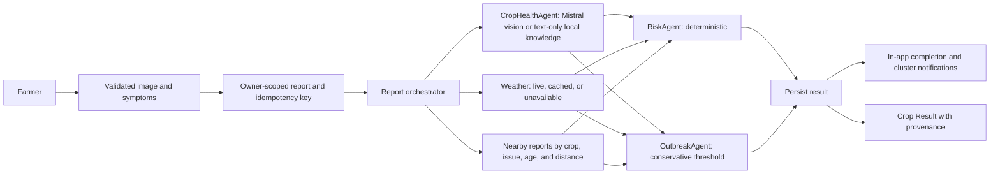

# AgriVision architecture

## Runtime shape

AgriVision is one React SPA and one FastAPI modular monolith. `src/App.tsx` owns navigation and the responsive shell; `src/features/` owns connected screens; `src/lib/api.ts` is the typed HTTP boundary; TanStack Query caches remote results; `src/lib/offlineQueue.ts` owns browser IndexedDB replay. Route components are lazy loaded except My Reports, which must remain available after a disconnected submission. Vite builds the PWA and precaches code and essential crop knowledge, not API responses or private images.

The backend follows **router → orchestration/service → agent and provider → repository**. `backend/app/api/` validates requests. `services/report_orchestrator.py` coordinates crop analysis. `agents/` contain specific decisions; `providers/` contain Mistral, Open-Meteo, OGD, and Supabase HTTP boundaries. Pydantic schemas validate external and agent outputs. The development repository is SQLite, with owner-scoped queries and durable caches. The production Supabase adapter is a read-only foundation and is not selected by the feature routes.

## Report flow

Uploads require JPEG, PNG, or WebP signatures and decodable images, are capped at 10 MB and 30 million pixels, and are read with a bounded endpoint limit. Mistral receives image, crop, text, season, and weather context only when a backend key is available. Its structured JSON response is schema validated and checked for obvious instruction, HTML/link, and dosage injection. Transient 429, network, timeout, and 5xx failures retry within bounds; an invalid output or exhausted failure falls back to conservative text-only knowledge. The result explicitly says whether the image was assessed. Hash keyed AI caching avoids repeated model calls on identical input and weather context.

Nearby matching uses Haversine distance, a seven-day window, a crop and issue match, and excludes the same owner. Risk scores never count synthetic observations as real community evidence. Outbreak signals need a moderate or high severity and spread, confidence of at least 0.65, and at least three **distinct** nearby owners. Real and synthetic owners are never combined to meet that threshold; synthetic signals are labelled. Locations in public cluster results are coarsened. Analysis completion and a qualifying cluster create persistent in-app notifications; a notification failure does not roll back an otherwise complete report.

## Market, soil, and offline flows

`MarketService` first reads a fresh cache, then OGD, then a stale cache, then a dated fixed-seed synthetic market file. `LIVE`, `CACHED`, or `FALLBACK`, observed dates, fetch dates, provenance, and `is_synthetic` travel with the result. Chart history and mandi comparisons use the returned observations. `MarketIntelligenceAgent` optionally asks Mistral for a cautious direction summary; a deterministic direction check is the fallback. Decimal arithmetic calculates the farmer-entered net return; no model calculates money.

The farm profile stores soil measurements and laboratory categories. Seed guidance checks crop season and context; fertilizer guidance only treats an explicit laboratory `low` category as a possible deficiency. It gives no brand, exact dose, or confirmed diagnosis. Missing values stay unknown.

The report form writes offline submissions and image Blobs to IndexedDB. My Reports reads that queue even when TanStack Query is offline. Reconnection triggers a single per-tab sync promise. Each report keeps one mutation UUID; SQLite has a unique `(owner_id, client_mutation_id)` index and rejects changed content for the same identifier. After create, the queue stores the server report ID before analysis; retry analyzes that same report and removes the queue entry only after completion.

## Why this is agentic AI

A conventional request can be endpoint → response. AgriVision's report endpoint coordinates multiple specialized modules, chooses a live model or bounded fallback based on provider state, gathers weather and nearby context, applies deterministic risk and cluster rules, persists the result, and issues an in-app action. The crop and market agents interpret unstructured or historical inputs; risk, outbreak thresholds, nutrient checks, and arithmetic are deterministic. The orchestrator follows a fixed workflow and does not plan arbitrary external actions, self-modify, or autonomously contact farmers. “Agentic” describes this bounded coordination, not unrestricted autonomy.

## Security and deployment boundary

`DEMO_MODE=true` is an explicit, development-only local identity. Production refuses demo mode. When demo mode is off, routes require a Supabase JWT verified against the configured asymmetric JWKS, issuer, audience, and subject. Feature routes then return 503 because the production repository is not complete. The browser never receives the Mistral key or a Supabase service-role key. Development writes are owner scoped and rate limited; errors return stable codes and request IDs without secrets or tracebacks.

The Phase 1 SQL migration declares 21 public tables, RLS on each, owner policies, composite owner foreign keys, query indexes, PostGIS locations, and a private user path scoped image bucket. [Supabase's RLS documentation](https://supabase.com/docs/guides/database/postgres/row-level-security) and [JWT verification guide](https://supabase.com/docs/guides/auth/jwts) describe the underlying mechanisms. This schema is an audited foundation, not evidence of a deployed or tested production integration. Before a public release, implement and test authenticated storage, owner policies under real Supabase users, migrations, rate limits shared across workers, and sign-in. Keep the demo server bound to localhost.

## Source and failure rules

Each provider has a timeout and source status. Weather failure returns stale cache or an unavailable advisory with no fabricated current temperature. Market failure returns stale cache or dated synthetic examples. Missing or failing Mistral returns a text-only result with low confidence; it cannot trigger a model-backed outbreak alert. Database failures leave an analyzable or retryable report where possible and return safe generic errors. Voice recognition is optional and text input always remains available. See [DATA_SOURCES.md](DATA_SOURCES.md) for attribution and exact fallback behavior.
